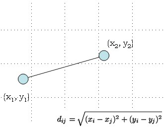
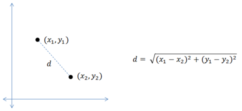
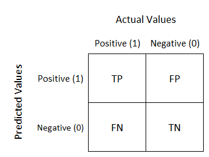

# Face-Detection-Using-Matlab
This Project was done using Matlab it is about detecting if a picture contain a face or not using Viola Jones Filter and KNN Algorithm.

The Images were in colours So first you have to change form rgb to grayscale in order to use the viola jones filter.

# Viola jones Filter:

I applied 3 different filters A, C and D

To compare the performace of those 3 Filters i used KNN Alogrithm

# KNN Algorithm:

It works by by determining the Distance between the point (Pic) we want to classify and the N number of nearest points.

# Measuring Performance using Confusion Matrix:

